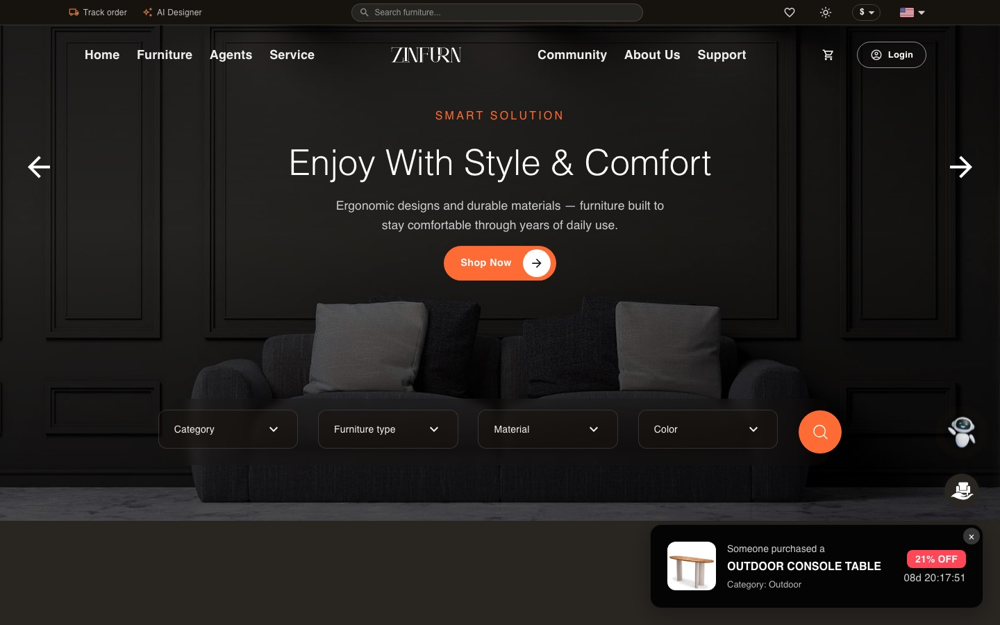
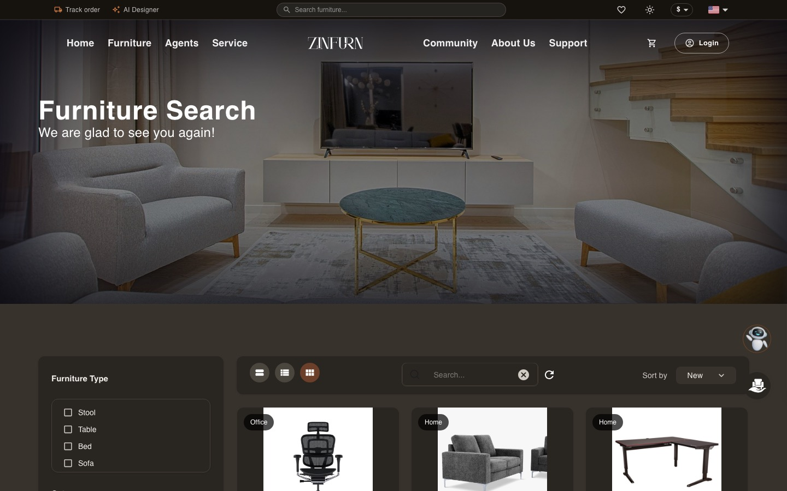

# Zinfurn — Furniture E-commerce Marketplace

**Live:** [zinfurn.uz](https://zinfurn.uz) · **API:** GraphQL @ api.zinfurn.uz · **Backend repo:** [Zinfurn](https://github.com/asadbek0512/Zinfurn)





A production-deployed furniture marketplace: catalog browsing with rich filters, ordering with coupons, a repair-service vertical, agent profiles, community articles, an AI shopping assistant, an AI room designer, native mobile AR placement, and a full admin panel — in 5 languages, on a hand-built dark/light theme system.

---

## Features

**Storefront**
- Product catalog with faceted filters (category, type, material, color, price, condition), typo-tolerant live search, list/grid view modes
- Flash Sale section driven by a server-side "active sale" filter with live countdowns
- Cart → 3-step checkout with **coupon codes** (percent/fixed, usage limits, expiry — the discount is computed server-side, never trusted from the client)
- Order lifecycle: pending → processing → shipped → delivered → confirmed, plus return requests
- **Telegram order notifications** — customers with a linked Telegram account get a bot message on every status change; admins get a new-order alert
- Purchase-gated reviews and ratings, favorites, recently viewed, agent following, real-time chat (WebSocket) and notifications
- Agents manage their own listings, including an in-stock / sold-out toggle that reflects instantly on every card

**AI**
- **Live community chat personas** — AI members (marked with an "AI" badge) keep the WebSocket chat active with short, casual threads that reply to each other, and answer real users; rate-limited to 15 messages/hour and only active while someone is online.
- **Shopping assistant** (`pages/api/ai-chat.ts` — Groq · `openai/gpt-oss-120b`, Gemini `gemini-3.6-flash` fallback) grounded in the live catalog: it recommends real products as clickable cards and navigates the site through a whitelisted action set, so the model can never invent a route or a product it hasn't been given.
- **AI Room Designer** (`analyzeRoom` / `generateRoomImage` GraphQL mutations, Gemini vision): the customer uploads a photo of their room and optionally describes what they want. The model returns a structured reading of the space — room type, dominant colors, suggested material, requested furniture type, a search keyword — every field validated against the project's own enums before it touches the database. Those constraints then drive a normal catalog query, so the recommendations are always real, in-stock products, never hallucinated ones. A chosen product can be composited back into the customer's own room photo through the image model.
- **Automatic content translation** (`translation.service.ts` — Groq `openai/gpt-oss-120b`, Gemini fallback): product, article and notice content is machine-translated into all five locales on create/update, in one schema-constrained JSON call, with a per-locale retry path if the batch call fails.

**AR / 3D**
- **Native AR placement** — `ArLaunchButton` on the product page calls `model-viewer`'s `activateAR()` directly inside the user gesture, so Android opens **Scene Viewer** and iOS opens **Quick Look** with the real system camera pipeline. `/ar-view` remains as the interactive 3D preview for desktop and for phones without AR support.
- **Real-world scale, not magic numbers.** Every GLB is normalized through `@gltf-transform/core` (`libs/utils/normalizeGlb.ts`): the mesh is scaled from the product's declared real width in centimetres, rested on the floor plane, and flat "studio floor" meshes emitted by generators are detected by bounding-box flatness and stripped. Because the metres are baked into the asset, AR opens at the correct physical size on the first try.
- **Image → 3D generation** (`pages/api/ar-generate.ts`, Meshy image-to-3D): an admin turns an existing product photo into a textured PBR model without leaving the panel. The API key never leaves the server — the browser only ever holds a task id and polls for progress.
- **Hardened asset pipeline.** `pages/api/ar-import.ts` fetches the generated GLB server-side (the generator CDN sends no CORS headers) behind an explicit host allowlist, an HTTPS-only check and a 25 MB cap, so the route cannot be turned into an open proxy. Hand-uploaded GLBs take the same path through `ar-normalize.ts`. Both return raw bytes that the admin panel uploads through the regular validated `modelUploader` mutation — one entry point into `uploads/`, one place to audit.
- Products without their own GLB fall back to six bundled reference models, matched by title keyword and category.

**Platform**
- i18n: `uz / en / ru / kr / ar` via next-i18next; prices follow the active locale (USD / KRW / UZS / RUB / AED) with live exchange rates and a 1-hour cache
- **Dark/light theming**: a single CSS custom-property token system (~40 semantic tokens replacing 270+ scattered hardcoded colors), a no-flash boot script, `prefers-color-scheme` as default, and MUI palettes derived from the same tokens
- SEO: SSR product list and detail pages (crawlers get real product HTML), sitemap, hreflang, JSON-LD
- Responsive: a dedicated mobile layout ≤768px; 769–1400px windows scale-to-fit so the fixed-width desktop design never clips
- Admin panel: users, properties, community, CS content, **coupons**, order management, 3D model generation

## Tech Stack

| Layer | Tech |
|---|---|
| Frontend | Next.js 14 (Pages Router) · TypeScript · MUI 5 · SCSS (token-based theming) |
| Data | Apollo Client (GraphQL) + WebSocket subscriptions |
| Backend | NestJS 10 monorepo · Apollo Server (code-first) · MongoDB/Mongoose |
| Auth | JWT (1h access + refresh rotation) · Google OAuth · Telegram OAuth |
| AI | Groq (Llama 3.3 70B · gpt-oss-120b) · Google Gemini (text, vision, image) |
| 3D / AR | `<model-viewer>` (Scene Viewer + Quick Look) · `@gltf-transform/core` · Meshy image-to-3D |
| Infra | Docker on VPS · Nginx + SSL · cron-based auto-deploy on push to `main` |

## Security Highlights

- **Brute-force protection**: global + per-endpoint rate limiting (login/signup 5/min, GraphQL-aware throttler guard behind `trust proxy`)
- **Token pair**: short-lived access token with refresh rotation; refresh tokens carry a `tokenType` claim that is rejected as an access credential; blocked members cannot refresh
- **Server-authoritative money math**: coupon validation and redemption are atomic (race-safe usage limits) and discounts are recomputed server-side
- **Uploads**: target-directory whitelist (path-traversal safe), extension pinning, image transcoding through `sharp` (a non-image cannot survive re-encoding); model uploads are size-capped and normalized before storage
- **Outbound fetches are allowlisted**: the AR import route accepts only HTTPS URLs on known generator hosts, so no user-supplied URL can make the server fetch arbitrary hosts (SSRF)
- **All AI keys are server-side only** — Groq, Gemini and Meshy credentials live in `.env` and are never exposed to the browser
- GraphQL: depth limit, introspection and playground disabled in production
- Nginx layer: HSTS, CSP (Telegram-widget aware), frame and content-type protections; helmet on the API

## Architecture

```
zinfurn/
├── zinfurn/                      # NestJS monorepo
│   ├── apps/zinfurn-api/         # GraphQL, WebSocket, OAuth, AI room, translation (:3007)
│   └── apps/zinfurn-batch/       # Cron jobs (monthly ranking)
└── zinfurn-next/                 # Next.js (:3006)
    ├── pages/                    # Routes (+ /_admin panel, /api AI & AR routes)
    ├── libs/components/          # Feature components (ar/, aiRoomDesigner/, property/, …)
    ├── libs/utils/normalizeGlb.ts# Real-world GLB normalisation
    ├── apollo/                   # Client, queries, reactive stores
    └── scss/                     # pc/ + mobile/ splits, theme tokens
```

Deploys are boring on purpose: push to `main` → the VPS cron detects the new commit within a minute → `git reset --hard` + container recreate → runtime build. A committed pre-push hook builds the project locally in an isolated dist dir, so a broken build can never reach `main`.

## Known Limitations

Being upfront — these are conscious trade-offs, not blind spots:

1. **Payments run in test mode only.** Toss Payments (KRW) is wired end-to-end — server-side confirm plus a cron that expires or reconciles unpaid orders — but uses sandbox keys; local PSPs (Payme/Click) are not integrated yet.
2. **Demo order progression.** Order statuses auto-advance (pending→delivered in ~1 min) so reviewers can see the full lifecycle without a warehouse. The next step time is stored on the order and a 10-second cron advances it, so progression survives restarts; in a real deployment this would be replaced by admin/ops updates.
3. **JWTs live in `localStorage`.** Mitigated by a strict nginx CSP; an httpOnly-cookie migration is planned but touches WebSocket auth and both OAuth flows, so it is deliberately a separate change.
4. **Refresh tokens are single-use and server-tracked.** Each session's current `jti` lives in the database: logout, password change or blocking a member revokes it immediately, and reuse of an old token closes the session. Tokens still live in `localStorage` (see 3).
5. **Test coverage is focused, not exhaustive.** Unit tests cover the money and trust paths — auth/session tokens, order pricing, Toss reconciliation, demo progression, coupons and purchase-gated reviews (57 tests); other modules rely on typed contracts and manual E2E passes.
6. **~60s deploy window.** Runtime-build deploys briefly 502; an earlier zero-downtime attempt was reverted for env-injection reasons and revisiting it needs build-arg plumbing.
7. **Single-instance assumptions.** Rate limiting and AI-chat state are in-memory, so horizontal scaling would need Redis first.
8. **3D coverage is partial.** Most of the catalog is photos only; products without their own GLB fall back to the bundled reference models. Filling the catalog is a content problem, and the generation pipeline exists precisely to grind it down.
9. **iOS AR needs USDZ for the best result.** Quick Look accepts the GLB path, but a per-product `ios-src` USDZ would render more faithfully; conversion is not yet part of the pipeline.
10. **Generated models are review-gated.** Image-to-3D output quality varies with the source photo, so every generated GLB is checked by an admin before it is attached to a product — the pipeline assists, it does not publish on its own.

## Roadmap

A pragmatic, value-ordered plan — what turns this from a polished showcase into a revenue-generating marketplace. Grouped by impact, not by effort.

### 🔴 Revenue & trust — ship first

These directly unblock money and buyer confidence.

- **Live local payments (Payme · Click · Uzum).** Payme/Click are wired as a demo checkout today; promoting them to production (server-side confirm + webhook reconciliation) is the single highest-value step for the UZ market, replacing the Toss sandbox.
- **Delivery & logistics.** Region-based shipping cost, estimated delivery date at checkout, and courier tracking numbers surfaced on the order timeline.
- **Seller dashboard.** Per-agent analytics — views → order conversion, revenue, best-selling products, low-stock warnings — so agents have a reason to list and restock.
- **Abandoned-cart recovery.** Telegram/email nudge when a cart is left unpaid; typically recovers a meaningful slice of lost orders with infrastructure that already exists (notifications are built).

### 🟡 Conversion & retention — grow the numbers

- **Recommendations & upsell.** "Related products", "frequently bought together", and recently-viewed-driven suggestions to lift average order value.
- **Loyalty points & tiers.** `memberPoints` already lives on the member schema — spend/earn rules + checkout redemption turn it into repeat-purchase fuel.
- **Back-in-stock & price-drop alerts.** Favorites already capture intent; notify the user when a saved item restocks or drops in price.
- **Promoted / featured listings.** Let agents pay to boost placement — a clean marketplace monetization channel on top of order flow.
- **Full returns & refund workflow.** Return requests exist; close the loop with approve → refund → restock states.

### 🟢 Professional polish — the ideal build

- **PWA + web push.** Installable app shell and push notifications (order updates, alerts) without a separate native build.
- **Per-product iOS USDZ** for higher-fidelity Quick Look AR (today iOS reads the GLB path).
- **Performance budget.** Lighthouse 95+ target, image CDN, route-level code splitting, and LCP/CLS tracking on the catalog and detail pages.
- **Accessibility (WCAG AA).** Keyboard navigation, focus states, and screen-reader labels across catalog, cart, and checkout.
- **Product analytics.** Funnel instrumentation (catalog → cart → pay) so roadmap priorities are driven by real drop-off data.

## Credits & Third-Party Work

- **[three.js](https://github.com/mrdoob/three.js)** (MIT) — via `<model-viewer>`, which is vendored as a standalone bundle because its ESM build pins a different three.js version than this app.
- **[`<model-viewer>`](https://github.com/google/model-viewer)** (Apache-2.0) — Scene Viewer / Quick Look entry point and 3D preview.
- **[@gltf-transform/core](https://github.com/donmccurdy/glTF-Transform)** (MIT) — server-side GLB normalisation.
- **[Meshy](https://www.meshy.ai/)** — image-to-3D generation API.
- The six bundled `.glb` stand-in models in `public/models/` come from **[cynthiachiu/3D-WebXR-Furniture](https://github.com/cynthiachiu/3D-WebXR-Furniture)** (MIT). An earlier version of this project also started from that repo's WebXR hit-test approach; that implementation has since been replaced end-to-end by the Scene Viewer / Quick Look pipeline described above, because WebXR renders the ARCore feed at a resolution no client-side setting can fix, and it does not exist on iOS at all.

## Running Locally

```bash
# backend (needs MongoDB + .env, see .env.example)
cd zinfurn && npm i && npm run start:dev     # :3007

# frontend
cd zinfurn-next && yarn && yarn dev          # :3006
```

Key env vars: `REACT_APP_API_URL`, `REACT_APP_API_GRAPHQL_URL`, `REACT_APP_API_WS`, `GROQ_API_KEY`, `GEMINI_API_KEY`, `MESHY_API_KEY` (image→3D), and on the backend `SECRET_TOKEN`, `MONGO_DEV`, plus the OAuth credentials.

---

**Author:** Asadbek Khusanov · [Telegram](https://t.me/Khusanov_Asadbek2000)
